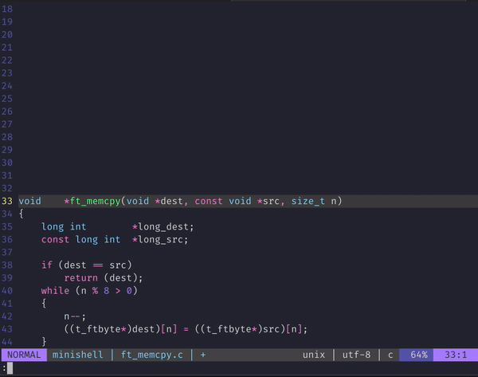

# doxy42.vim

A vim plugin to add doxygen like comment for function declarations.



## Usage

Execute `:Doxy42` on a function declaration,
it will generate a doxygen comment above.

```
/*
** \brief
** \param format
** \param ap
*/

void		verrorf(const char *format, va_list ap)
```

```
/*
** \brief
** \param dest
** \param src
** \param n
** \return
*/

void	*ft_memcpy(void *dest, const void *src, size_t n)
```

It will align the `\brief`, `\param` and `\return` with spaces.
You can press `n` to go to the next field to complete
(`$` is put in your search register).
